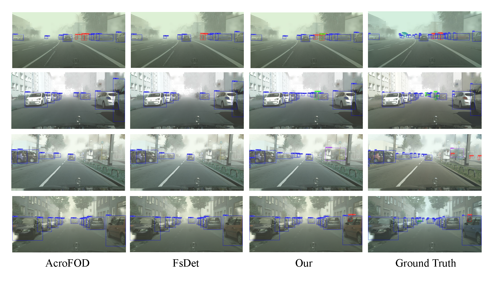
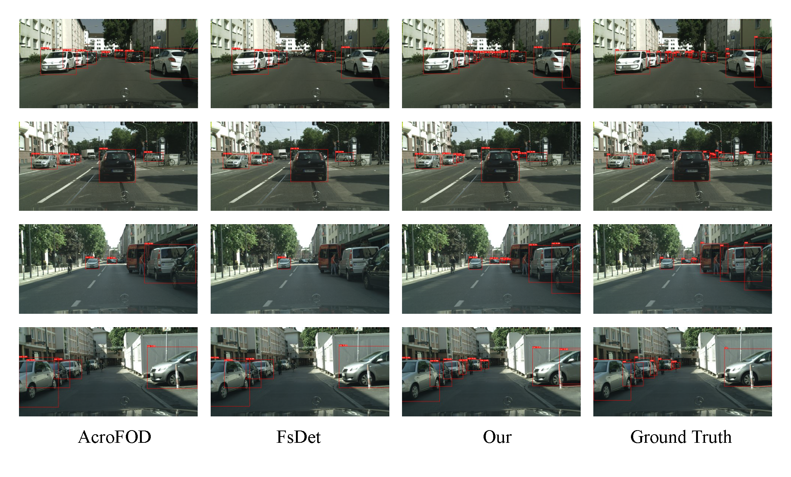
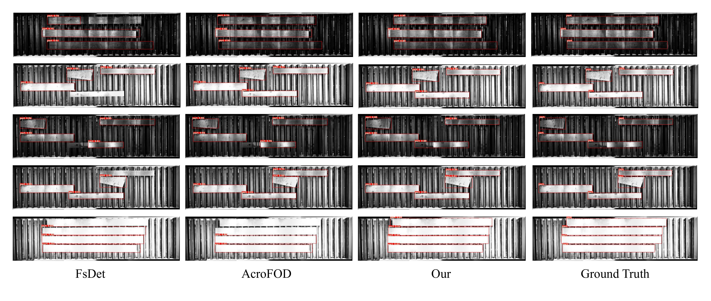

# :sparkles: MS2A: Memory Storage-to-Adaptation for Cross-domain Few-annotation Object Detection [[Project Page]](https://ms2a-cfod.github.io/)
This repository contains the code for reproducing the paper: **[MS2A: Memory Storage-to-Adaptation for Cross-domain Few-annotation Object Detection](https://)**
## Overview


## Example Results
**Qualitative comparisons on public datasets C $\rightarrow$ F setting.**

**Qualitative comparisons on public datasets K $\rightarrow$ C setting.**

**Qualitative comparisons on public datasets S $\rightarrow$ T1 setting.**

## Installation
Please refer to [Installation](https://mmdetection.readthedocs.io/en/latest/get_started.html) for installation instructions.

## Dataset
Please download our proposed `Industrial Datasets` from [here](https://pan.baidu.com/s/1QIVEVO5n1RYEGndHPe6aRg?pwd=cfod#list/path=%2F). It consists of two settings, `Indus_S`  $\rightarrow$ `Indus_T1` and `Indus_S`  $\rightarrow$ `Indus_T2`. We use LabemMe for labeling and annotate all the objects as the part class. More information about the size of the training set and test set can be obtained by browsing the table below.

<div style="text-align: center;">
<table>
<thead>
  <tr>
    <th rowspan="2"></th>
    <th colspan="2">Indus_S&rarr;Indus_T1</th>
    <th colspan="2">Indus_S&rarr;Indus_T2</th>
  </tr>
  <tr>
    <th>Source</th>
    <th>Target</th>
    <th>Source</th>
    <th>Target</th>
  </tr>
</thead>
<tbody>
  <tr>
    <td>train</td>
    <td>4614</td>
    <td>10、30、50</td>
    <td>4614</td>
    <td>10、30、50</td>
  </tr>
  <tr>
    <td>test</td>
    <td>1153</td>
    <td>269</td>
    <td>1153</td>
    <td>432</td>
  </tr>
</tbody>
</table>
</div>

## Pretrained model for quick start
All used pretrained models can be downloaded from [here](https://pan.baidu.com/s/1wdJYaYoUQVV1hcgnCLpf5w?pwd=ccbt).The `yolox_x_8x8_300e_coco_20211126_140254-1ef88d67.pth` is the pretrained model from [mmdetection](https://github.com/open-mmlab/mmdetection). `city_foggycity_epoch_20.pth`, `kitt_city_epoch_18.pth` and `sim10k_city_epoch_15.pth` are pretrained model on public dataset cityscapes2foggycityscapes, kitti2cityscapes and sim10k2cityscapes task respectively.

## Training from scratch
#### Stage I - Memory Storage
```shell
1. pretrain base detector
./tools/dist_train.sh ${config_file} ${gpu_number}
e.g: ./tools/dist_train.sh ./configs/yolox/yolox_fs_x_640x640_50e_18_base.py 1

2. extract and cluster the prior knowledge
python extract_fea_fewshot.py \
 --depart ${dataset name} \
 --img ${image dir} \
 --config ${config file} \
 --checkpoint ${checkpoint file} \
 --out_path ${save dir} \
 --batch_size 8 \
 --dim ${128/256 large:256}
e.g: 
python extract_fea_fewshot.py \
 --depart Indus_T1 \
 --img /nas/public_data/foggy_cityscapes_COCO_format/train2014 \
 --config ./configs/yolox/yolox_fs_x_640x640_50e_cityscapes_base.py \
 --checkpoint ./work_dirs/yolox_fs_x_640x640_50e_cityscapes_base/best_bbox_mAP_epoch_70.pth \
 --out_path /path/to/save/extracted/feture \
 --batch_size 8 \
 --dim 320

python knn_cuda.py \
 --fea_root_path ${last step saved dir} \
 --out_path ${default same as fea_root_path} \
 --n_clusters ${default 100} \
 --depart ${cluster name}
e.g:
python knn_cuda.py \
 --fea_root_path /path/to/save/extracted/feture/ \
 --out_path /path/to/save/cluster/results/ \
 --n_clusters 100 \
 --depart Indus_T1
```

#### Stage II - Memory Adaptation
```shell
1. Source Training
./tools/dist_train.sh ${config_file} ${gpu_number}
e.g: ./tools/dist_train.sh configs/yolox/yolox_fs_x_640x640_50e_cityscapes_pretrain_mom.py 1

2. Target Training
./tools/dist_train.sh ${config_file} ${gpu_number}
e.g: ./tools/dist_train.sh configs/yolox/yolox_fs_x_640x640_50e_cityscapes_pretrain_mom_ft.py 1
```
## Evaluation
```shell
python tools/test.py ${config file} ${checkpoint file} [--out ${RESULT_FILE}] [--eval ${EVAL_METRICS}] [--show]
e.g:
python tools/test.py \
 ./configs/yolox/yolox_fs_x_640x640_50e_cityscapes_pretrain_mom_ft.py \
 ./work_dirs/yolox_fs_x_640x640_50e_cityscapes_pretrain_mom_ft/best_0_bbox_mAP_epoch_20.pth \
 --eval bbox
```
## Inference
```shell
python tools/inference.py ${config file} ${checkpoint file} ${save dir}
e.g:
python tools/test.py \
 ./configs/yolox/yolox_fs_x_640x640_50e_cityscapes_pretrain_mom_ft.py \
 ./work_dirs/yolox_fs_x_640x640_50e_cityscapes_pretrain_mom_ft/best_0_bbox_mAP_epoch_20.pth \
 ./path/to/save
```

## Thanks
Thanks to the public repos: [mmdetection](https://github.com/open-mmlab/mmdetection) for providing the base code. 